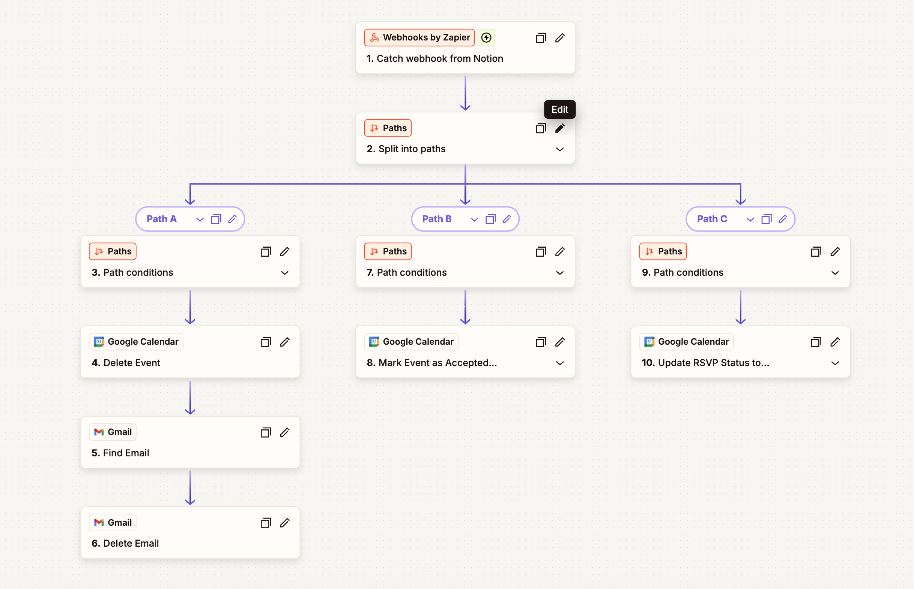

# Sovereign Attention Firewall

A zero-trust security perimeter for your digital focus.

The **Sovereign Attention Firewall** is an automated enforcement system designed to protect your most valuable asset: your attention. Built for the Notion MCP Challenge, it identifies, quarantines, and silences **Calendar Snipers** (unverified external invites) and **Ghost Projects** (meetings tied to archived work) before they ever interrupt deep work.

[📺 Video Demo](#) | [📝 Dev.to Submission](#)

## 🏛️ System Architecture

The firewall operates as a distributed security circuit between Google Workspace, a custom Cloudflare-hosted MCP, Notion, and Zapier.


### 1. The Oracle & Bouncer (Verification)

When a new external invite is received in Google Workspace, the Notion Agent initiates an audit using the **Sovereign Bouncer** (Custom MCP).

- **The Bouncer (Policy Layer):** A Cloudflare Worker that enforces Bearer auth and manages trust logic.
- **The Oracle (Data Authority):** A deterministic registry that returns trust scores and verification status for any given email.
- **Edge Caching:** Resulting verdicts are cached in Cloudflare KV for sub-second performance.

### 2. The Waiting Room (Governance)

Unverified contacts (**Identity Phantoms**) or meetings tied to archived projects (**Ghost Projects**) are moved to a quarantine state.

- **Decision Desk:** Invites are logged into the 📥 Waiting Room DB in Notion for human review.
- **State-Lock:** Once a human decision is made, the Agent locks that state so AI never overrides a manual choice.

### 3. The Enforcement Engine (Execution)

Final actions are executed through a multi-path Zapier webhook bridge.



- **Path A (Block):** Deletes the calendar event and permanently scrubs the source email from Gmail.
- **Path B (Approve):** Formally accepts the RSVP via a `PATCH` request to preserve event metadata.
- **Path C (Reject):** Formally declines the invite, signaling a professional boundary.

## 📂 Repository Structure

```bash
├── /identity-oracle            # Cloudflare Worker: Identity Source of Truth
├── /sovereign-bouncer-mcp      # Cloudflare Worker: Custom MCP Server & KV Caching
├── /notion-governance          # Agent Instructions (The Constitution) & DB Schemas
└── /zapier-enforcement         # Webhook logic for Silent Deletion and RSVPs
```

## 🛠️ Setup & Installation

### 1. Cloudflare Workers

Deploy the Oracle and Bouncer:

```bash
cd identity-oracle && wrangler deploy
cd sovereign-bouncer-mcp && wrangler deploy
```

Create a KV namespace for trust caching, then set its ID in `sovereign-bouncer-mcp/wrangler.jsonc` for `SOVEREIGN_KV`:

```bash
cd sovereign-bouncer-mcp
wrangler kv namespace create SOVEREIGN_KV
```

Copy the returned namespace `id` and replace `REPLACE_WITH_YOUR_SOVEREIGN_KV_ID` in `wrangler.jsonc`.

Set runtime values as Wrangler secrets before deploying.

```bash
cd sovereign-bouncer-mcp
wrangler secret put SOVEREIGN_SECRET
wrangler secret put IDENTITY_ORACLE_URL
```

### 2. Notion Agent

- Connect the Notion MCP to your workspace.
- Import the Sovereign Policy DB and Waiting Room DB.
- Add `instructions.md` (The Constitution) to your Agent's system prompt.

### 3. Zapier Bridge

- Create a new Zap with a **Webhooks by Zapier** trigger.
- Map the three paths (Approve, Reject, Block) to corresponding Google Calendar and Gmail actions as documented in `/zapier-enforcement`.

## ⚖️ The Sovereign Principles (Absolute Rules)

- **Silence is Security:** The system never “declines” a phantom. It deletes silently (`sendUpdates=false`) so spammers never get a signal that your address is active.
- **2-Strike Escalation:** If a sender is manually rejected twice in Notion, they are automatically promoted to the 🚫 Block List DB for future hard denials.
- **Contextual Integrity:** If a project is marked “Archived” in Notion, all related future meetings are automatically treated as Ghost Projects.

## 🔐 Environment Strategy (GitHub Safe)

- Do not commit real environment values in `wrangler.jsonc`.
- Store sensitive and deployment-specific values as Cloudflare secrets:
  - `SOVEREIGN_SECRET`
  - `IDENTITY_ORACLE_URL`
- Do not commit real Cloudflare resource IDs (for example KV namespace IDs). Keep placeholders in Git and set real IDs per environment.
- Keep local-only files (`.env*`, `.dev.vars*`, `.wrangler/`) out of Git via `.gitignore`.
- If you need to share required keys with collaborators, document key names only, not key values.

## 🏆 Notion MCP Challenge

This project demonstrates Notion as an orchestration layer for complex, distributed AI systems. By bridging edge compute (Cloudflare) and workplace automation (Zapier), it creates a system that doesn't just organize work; it defends it.
